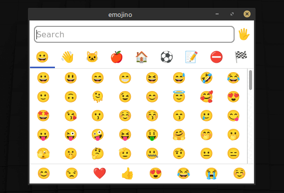

# ☕️ emojino

A simple emoji picker app for Linux. Built with [emoji-picker-element](https://github.com/nolanlawson/emoji-picker-element) and [Neutralino](https://neutralino.js.org/).

## Usage

- Type to filter emojis.
- Click an emoji to copy it to your clipboard.

## Motiviation

I wasn't happy with the (lack of) built-in emoji picker on my operating system. It works fine in native text inputs, but just isn't available on input fields in my browser, or my code editor. I wanted a simple solution that I could open from anywhere, and that would work anywhere, without getting in my way.

So I just wrapped the amazing [emoji-picker-element](https://github.com/nolanlawson/emoji-picker-element) with [Neutralino](https://neutralino.js.org/) to make it an app. Built-in dark mode support and everything.

All that was left was to `autofocus` the search input, and make Neutralino copy to clipboard on click 🏁

## Install

There is only a `.deb` package for x86 Ubuntu/Debian availabe today. Download it from the latest release.

To build the package yourself instead, follow the instructions in the _Develop_ and _Build_ sections below.

> **Tip:** After installtion, create a custom keyboard shortcut like <kbd>Ctrl</kbd><kbd>Alt</kbd><kbd>E</kbd> to start Emojino from anywhere in your desktop environment.

If you want to install this on a different operating system, please open an issue to let me know. Technically it should work even on Windows and MacOS, but I haven't tried it on these platforms.

## Develop

- Install the [`neu` CLI](https://neutralino.js.org/docs/cli/neu-cli).
- Run `neu update` to download the Neutralino binaries.
- Run `setup.sh` to download other assets from CDN.
- Run `neu run` for local development with live reload.
- Or, run `neu build` to build an executable binary.

## Build

Make sure you have followed the steps from the _Develop_ section above first.

To build the Ubuntu/Debian package, run `release.sh`.

## Logo

The logo is the ☕️ from [Twemoji](https://emojipedia.org/twitter/twemoji-15.0.3/hot-beverage).

## License

[MIT](LICENSE)
